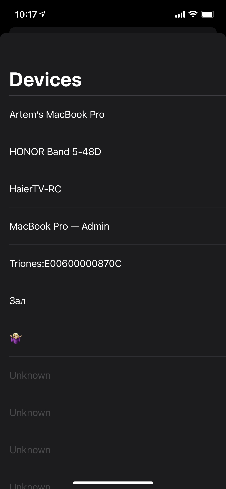
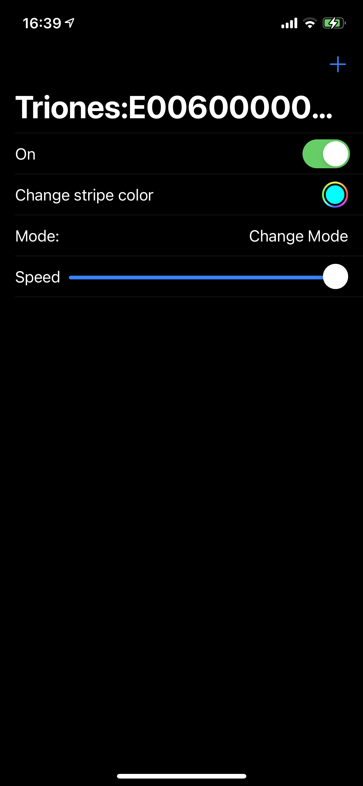

# ColorStripe

An experiment app for RGB stripe control. Written in SwiftUI+Combine. Read about dev journey in [my blog](https://blog.artemnovichkov.com/bluetooth-and-swiftui).

  
  

## Author

Artem Novichkov, mail@artemnovichkov.com

## License

The project is available under the MIT license. See the [LICENSE](./LICENSE) file for more info.
